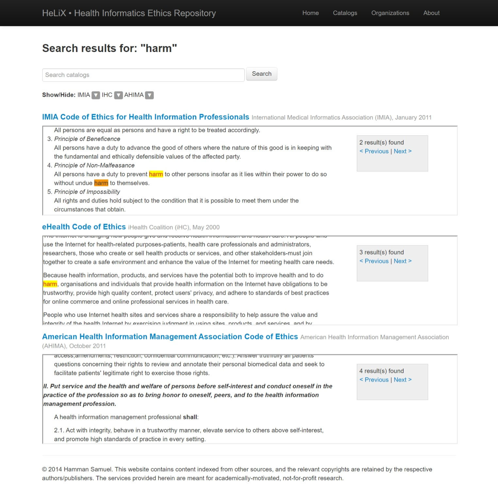

# HeLiX
The HeLiX health informatics ethics repository is a searchable platform of ethics codes and technical standards related to health informatics ethics. Please cite the following publication (DOI: [10.5210/ojphi.v6i2.5484](http://dx.doi.org/10.5210/ojphi.v6i2.5484)) when modifying or using this source code.

```
@article{PMID25422725,
  title = {{A Repository of Codes of Ethics and Technical Standards in Health Informatics}},
  author = {Samuel, Hamman and Zaiane, Osmar},
  journal = {Online Journal of Public Health Informatics (OJPHI)},
  volume = {6},
  number = {2},
  year = {2014},
  publisher = {PubMed Central (PMC)}
}
```

# Demo

A working [live web app](http://199.116.235.207:82/helix/) is available online for demo purposes.



# Setup
This web app can be run on any server that supports PHP. Tested with PHP Version 7.2.6. For local use, [XAMPP](https://www.apachefriends.org) is recommended for quick set up.

# Admin
The code contains an interface for an admin backend with placeholder default username and password configured in `bootstrap.php`. The backend can be accessed in the running web app via `localhost/admin.php`

# Disclaimer
The code contains content indexed from other sources, and the relevant copyrights are retained by the respective authors/publishers. 

Below is a listing of the organizations whose materials that have been indexed in HeLiX with permission where necessary. The services provided herein are meant for academically-motivated, not-for-profit research.

- [International Medical Informatics Association (IMIA)](http://www.imia-medinfo.org/new2/pubdocs/Ethics_Eng.pdf)
- [UK Council for Health Informatics Professionals (UKCHIP)](http://www.ukchip.org/?page_id=1607)
- [iHealth Coalition (iHC)](http://www.ihealthcoalition.org/ehealth-code/)
- [British Computer Society (BCS)](http://www.bcs.org/upload/pdf/conduct.pdf)
- [American Health Information Management Association (AHIMA)](http://library.ahima.org/xpedio/groups/public/documents/ahima/bok1_024277.hcsp?dDocName=bok1_024277)
- [Australasian College of Health - Informatics (ACHI)](http://www.achi.org.au/docs/ACHI%20Professional%20Code%20of%20Conduct.pdf)